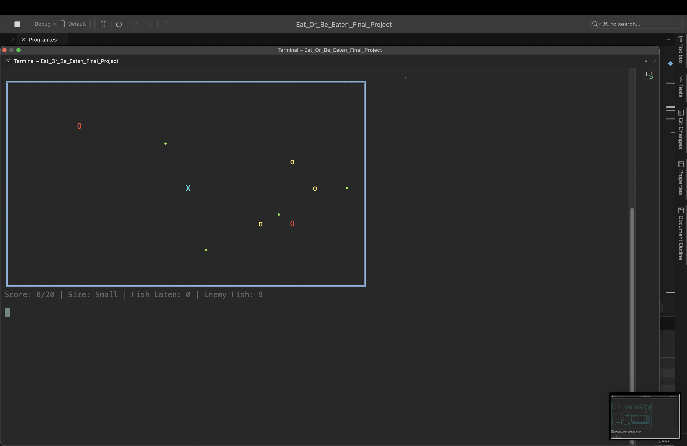
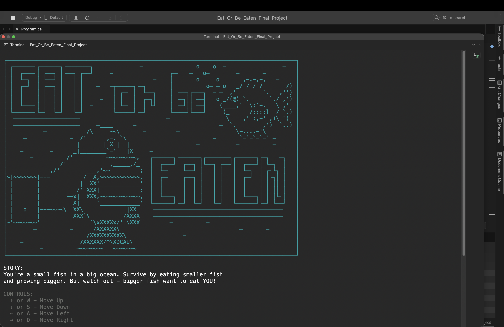
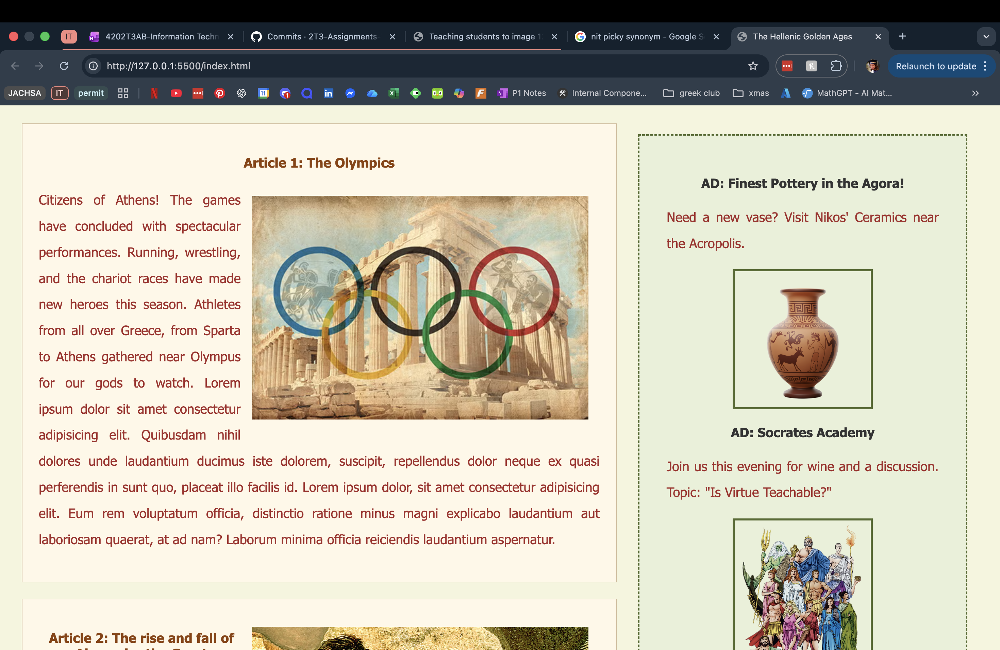
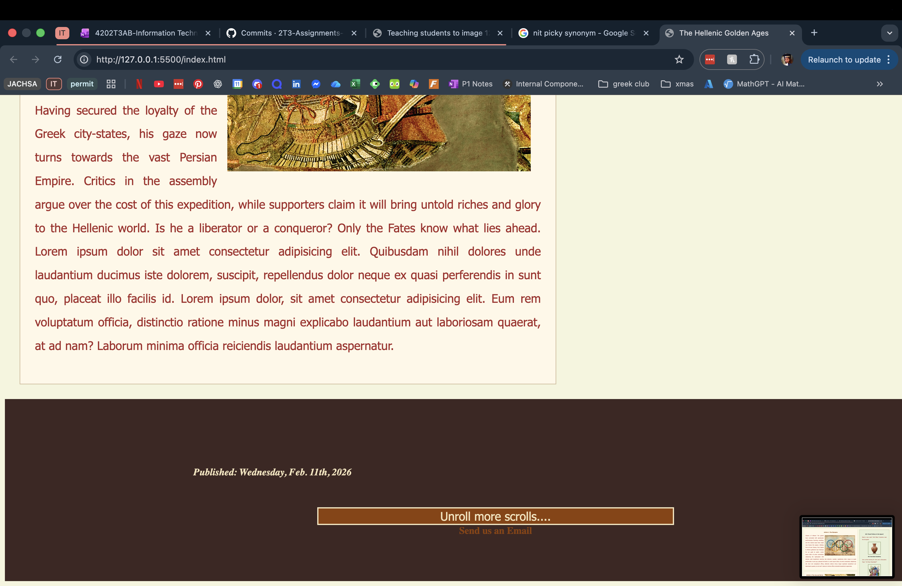

# Project 1: **Final Project Programming 1 - Eat or be eaten** #

## Description: ##
Create a game using our basic C# level knowledge. This game includes a score system, a menu, specific rules depending on the topic, setting area where the game takes place and an objective.

## Technologies Used: ##
* Mac Laptop
* Applications:
  * Omnivox
  * Visual Studio
  
## Code Snippets from Projects - Main Menu Output: ##
```
Console.Clear();
            Console.ForegroundColor = ConsoleColor.DarkCyan; //Used to make menu: https://asciiflow.com & https://asciiart.cc/t-10736/fish
            Console.WriteLine("┌───────────────────────────────────────────────────────────────────────────────────────┐");
            Console.WriteLine("│ ┌──────┐┌──────┐┌───────┐              ─                o    o  ─                 ─   │");
            Console.WriteLine("│ │  ┌───┘│ ┌──┐ │└──┐ ┌──┘     ─                 ┌─┐   ─   o─        ─       ─         │");
            Console.WriteLine("│ │  └─┐  │ └──┘ │   │ │                     ─    │ │     o     o       ,-.-,-,   ─     │");
            Console.WriteLine("│ │  ┌─┘  │ ┌──┐ │   │ │    ─   ─┬─────┐┌─┐       │ │        o─ ─ o   _/ / / /       /) │");
            Console.WriteLine("│ │  │    │ │  │ │   │ │         │ ┌─┐ ││ └──┐    │ └──┐┌───┐  ─ ─  ,'        `.   ,'') │");
            Console.WriteLine("│ │  │    │ │  │ │   │ │     ─   │ │ │ ││ ┌─┐│    │ ┌─┐││ ──┤   o _/(@) `.      `./ ,') │");
            Console.WriteLine("│ │  └───┐│ │  │ │   │ │  ─      │ └─┘ ││ │ └┘    │ └─┘││ ──┤    (____,`  \\:`-.   \\ ,'  │");
            Console.WriteLine("│ └──────┘└─┘  └─┘   └─┘         └─────┘└─┘       └────┘└───┘     (_      /::::}  / `.) │");
            Console.WriteLine("│  ────────────────────                          ─                 \\    ,' :,-' ,)\\ `)  │");
            Console.WriteLine("│  ────────────────────     ─____      ─                         ─  `.        ,')  `..) │");
            Console.WriteLine("│           ─            /\\|    ~~\\       ─         ─                 \\-....-'\\         │");
            Console.WriteLine("│     ─             ─  /'  |   ,-. `\\                          ─       `-`-`-`-` ─      │");
            Console.WriteLine("│                     |       | X |  |                    ─           ─          ─      │");
            Console.WriteLine("│    ─        ─      _|________`-'   |X     ─                                           │");
            Console.WriteLine("│       ─          /'          ~~~~~~~~~,   ┌──────┐┌──────┐┌───────┐┌──────┐┌─┐   ┬┐   │");
            Console.WriteLine("│                /'             ,_____,/_   │  ┌───┘│ ┌──┐ │└──┐ ┌──┘│  ┌───┘│ └─┐ ││   │");
            Console.WriteLine("│             ,/'        ___,'~~         ;  │  └─┐  │ └──┘ │   │ │   │  └─┐  │ ┌┐└┐││   │");
            Console.WriteLine("│~|~~~~~~~|---          /  X,~~~~~~~~~~~~,  │  ┌─┘  │ ┌──┐ │   │ │   │  ┌─┘  │ │└┐│││   │");
            Console.WriteLine("│ |       |            |  XX'____________'  │  │    │ │  │ │   │ │   │  │    │ │ ││││   │");
            Console.WriteLine("│ |       |           /' XXX|            ;  │  │    │ │  │ │   │ │   │  │    │ │ ││││   │");
            Console.WriteLine("│ |       |        --x|  XXX,~~~~~~~~~~~~,  │  └───┐│ │  │ │   │ │   │  └───┐│ │ │└┘│   │");
            Console.WriteLine("│ |       |          X|     '____________'  └──────┘└─┘  └─┘   └─┘   └──────┘└─┘ └──┘   │");
            Console.WriteLine("│ |   o   |---~~~~\\__XX\\             |XX     ───────────────────────────────────────    │");
            Console.WriteLine("│ |       |          XXX`\\          /XXXX    ───────────────────────────────────────    │");
            Console.WriteLine("│~'~~~~~~~'               `\\xXXXXx/' \\XXX         ─          ─                          │");
            Console.WriteLine("│        ─          ─      /XXXXXX\\                                    ─       ─        │");
            Console.WriteLine("│                        /XXXXXXXXXX\\                 ─                                 │");
            Console.WriteLine("│    ─                 /XXXXXX/^\\XDCAU\\                                                 │");
            Console.WriteLine("│          ─          ~~~~~~~~   ~~~~~~~                                                │");
            Console.WriteLine("└───────────────────────────────────────────────────────────────────────────────────────┘");
            Console.ResetColor();
```

## Screenshot from the Project: ##




### What I learned? (short reflection) ###
Creating a big and long project like this one, especially for the first time requires a lot more time, organisation and commitment than I realised. The amount of hours spent on tweaking, problem-solving and adjusting certain issues, not matter the size, showed how much every little detail matters in your work and it is important to focus all of your attention on creating the best possible outcome in the time you have to perform this project.

### Link to repo (if available) ###
>Not available, only learnt repos this semester...

*________________________________________________________________________*

# Project 2: **Lab User Interfaces - Ancient Greece Newspaper Website** #

## Description: ##
Help us understand the basic fundamentals of HTML and CSS by navigating a simple structure and creating a newspaper from a certain decade/era (I chose ancient Greece). Main idea: using float (how difficult it is).

## Technologies Used: ##
* Mac latop
* Applications:
  * Omnivox
  * Visual Studio Code
  * Google (Research different styling)
  
## Code Snippets from Projects - CSS: ##
```
h1 {
    color: #3e2723;
    background-color: transparent;
    text-align: center;
    font-size: 90px;
    width: 90%;
    margin: 0px;
    padding: 0px;
    font-family: 'Segoe UI', Tahoma, Geneva, Verdana, sans-serif;
}

h2 {
    font-family: 'Segoe UI', Tahoma, Geneva, Verdana, sans-serif;
    font-size: larger;
    color: #8d4004;
    text-align: center;
    padding: 5px;
}

h3 {
    font-family: 'Segoe UI', Tahoma, Geneva, Verdana, sans-serif;
    color: #333;
    margin-bottom: 5px;
}
```
## Screenshot from the Project: ##




### What I learned? (short reflection) ###
### Link to repo (if available) ###
>Not available, only learnt repos this semester...